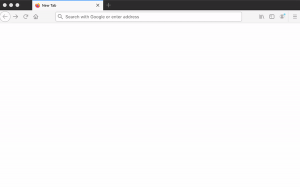
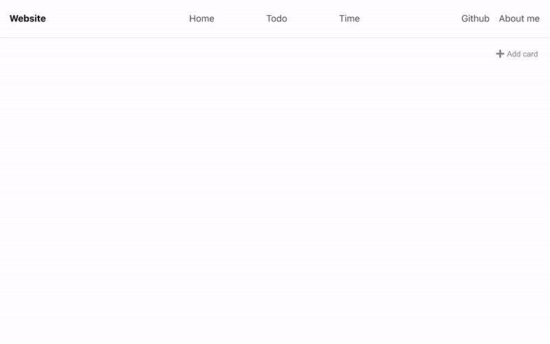
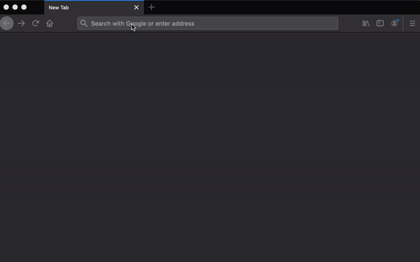

## Project: my daily planner

## Currently paused because of school work

This is a simple web daily planner app I am trying to make.  I was inspired to make this app because I feel like I need to use multiple apps just for planning out my days, which is a bit inefficient.  
I will be building frontend with react, backend with express, and connect the app to mongoDB datebase. Also try to deploy the website using a free host. I have no prior web development experiences and will be learning and recording useful things that I learned along the way.

**My goal is that every user has their own data stored in database, and can only be accessed when they log in with their google account.**

## Features

1. **Homepage**: The homepage will display current time, date, and weather at the top. Also several display cards that display information from todo list and timetable.
2. **Weather card**: The app will detect user's geolocation(given permission), and display current weather and date at user's location. The user can also search for weather at other cities. 
3. **Todo list**: The user can add, delete, name/rename a todo list, also add, delete, and edit an event from a todo list. They can create multiple todo lists and each of them has multiple todo event.
4. **Timetable**: A timetable that the user can add new events at different timeslots, edit added events, and delete unwanted events.

## How to use
Frontend is deployed on netlify, [link](https://ffy-my-daily-planner.netlify.app/), currently being working on so the link might not work  
Backend api is deployed on heroku, [link]( https://ffy-my-daily-planner-backend.herokuapp.com/), currently does not have a view engine, purely served as an api.

## What I learned

General:  
1. Never save API keys or secrets in frontend, it is best to save them as env variables in backend
2. Use devDependencies to seperate development packages and production packages

Code related:  
Details see READMEs in frontend and backend

## Development logs

### Frontend  
* **Aug 12**:  
	1. Move old basic website into a seperate folder, re-initialize all website using **react**.

---
* **Aug 13**:   
	1. Partialy finished top nav bar, currently have logo on the left, main menus on the middle, and github link, about me on the right. Hover effect is added
	2. Need to implement: active effect.

---
* **Aug 24 - 26**:  
	1. Finished the top nav bar, active effect is done  
	2. Finished the sub nav bar, add a button on the right to add new item based on what page the brower is currently on  
	3. Started working on todo and home  

---
* **Aug 27 - 29**:  
	1. Finished Homepage card system
	2. Added **wheather** feature. The app will detect user's geolocation(given permission), and display current weather and date when first visiting the website. The user can later also search for weather at other locations. 

	**Weather demo**:  
	

---
* **Aug 30 - 31**:  
	1. Finished todo card system, the user can add todo cards.
	2. Finished todo list, the user can add new todos in each todo card.
	3. Add icons and add licences.txt  

	**Todo-list demo:**  
	

---
* **Sept 1 - 5**:  
	1. Learning backend.
	2. Move weather API call into backend and hide the API key in the backend environment varibale file.
	3. Change Weather.js in frontend so that it uses POST method and send query info to backend and call weather API there, instead of using query info and fetch weather API in the frontend.

---  
* **Sept 6 - 8**:  
	1. Learning how to connect to a database that can authorize users infomation and input
	2. Learning how to let user upload a file.

---  
* **Sept 9**:
	1. Finished navigation system by using **react-router**
	2. Add "add card" to homepage so that the user can add new information card.
	
	**navigation demo:**  
	

--- 
* **Sept 10 - 16**:
	1. Create backend with express, cors, mongoose, passport.js, etc.. (detail list see package.json)
	2. Connect backend to mongoDB using mongoose
	3. Create User model
	4. Create index, weather, auth routes
	5. User can now log in with google account, this is accomplished by using passport.js
	6. Save google id and session id into database for future use.
	7. Create new User model when a new user logs in with google account, and save the model into mongoDB database

---  
* **Sept 17 - 19**:
	1. Create user landing page where they can use google account to login
	2. Connect backend auth to frontend by using REST end point
