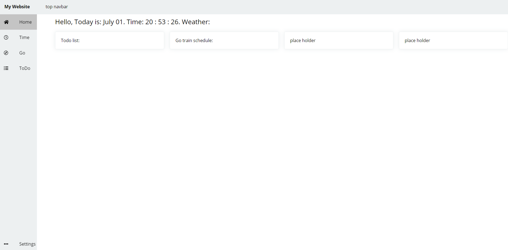

# Project name: my-first-website

# Description/feature: 
1. *homepage*: display time/date/weather and todo-list/go-schedule/next-event-reminder that user made 
 2. todo-list: users can add things todo to a list, remove events when them get ticked off 
 3. go-schedule: users can search for a train line, display choosen line's schedule, includes next arrival time, depature time. 
 4. timetable: users can import time table using iso file, or add own event at a time slot. 
 5. settings to change theme(maybe?)

# Things I learnt:

Basic frontend: basic html/css/javascript  
Advanced frontend: react.js  
Backend: node.js
general: how to use api properly, nvm, npm, responsive ui, interactive/motion ui

# Installation: 
open index.html in () folder to access locally or use live server to deploy on a local server

# Development logs

* **June 27- add layout design pdf, may change later**  
learnt today: basic html and css knowledge. 

---------------------------------------------------------------------------

* **June28: general layout is done** 
learnt today: css flexbox. 

---------------------------------------------------------------------------

* **June 29-Jul 1: homepage**: 
learnt today:  
a. how to use media in css to achieve responsive website. (changes interface according to window size) 
b. how to use external javascript file to help building html 
c.

progress:  
a. active element is now highlighted. 
b. homepage is implemented.  
c. homepage displays data from other places. 
d. implement greeting messages. include time, date, weather(to be finished). 

 

---------------------------------------------------------------------------

* **July 2-4: Link navbar links to different pages  

placeholder

* **July 4-12: pause project, working on school stuff  

placeholder
