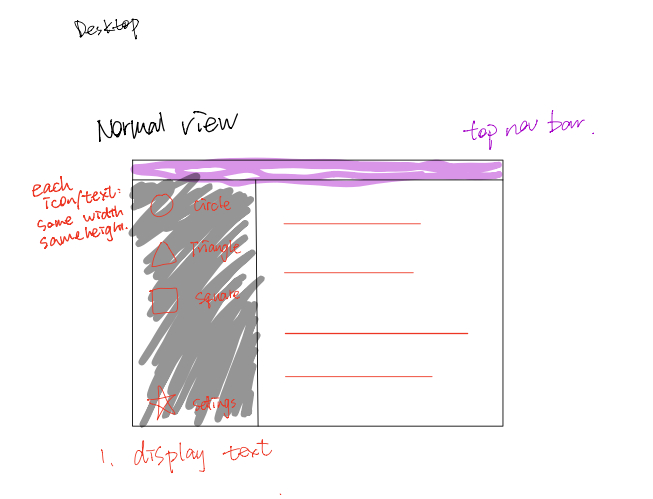
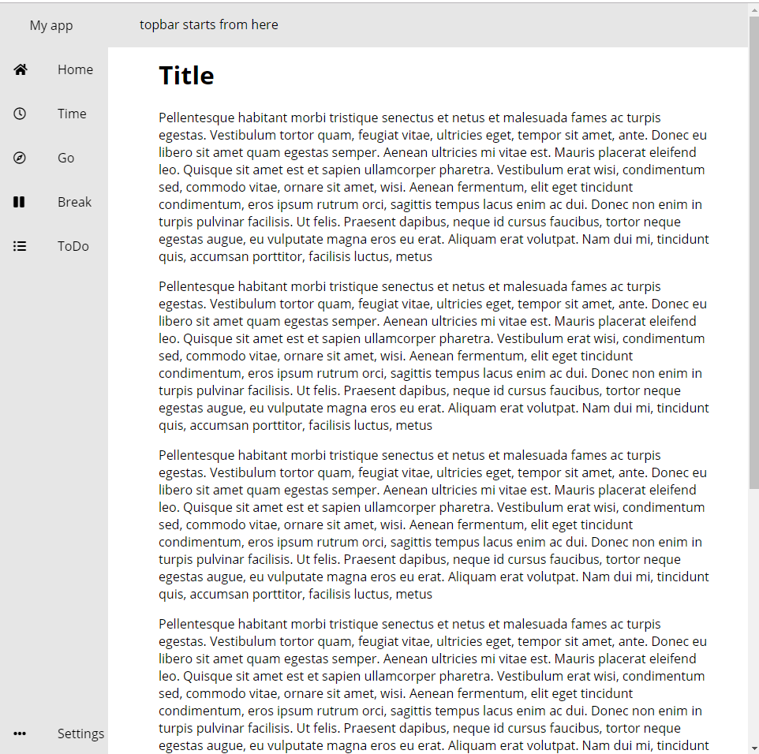
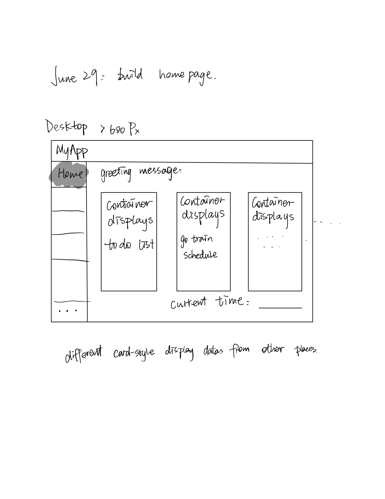

## Project name: my-first-website

## Feature: 
1. **homepage**: display time/date/weather and todo-list/go-schedule/next-event-reminder that user made 
 2. **todo-list**: users can add things todo to a list, remove events when them get ticked off 
 3. **go-schedule**: users can search for a train line, display choosen line's schedule, includes next arrival time, depature time. 
 4. **timetable**: users can import time table using iso file, or add own event at a time slot. 
 5. **settings**: users are able to change theme(maybe?)

## What I learned:
 **Basic frontend**: basic **html/css/javascript**  
 **Advanced**: <u>**react**</u> as __**frontend framework**__  
 **Backend**: __**node.js**__ 
 **Advanced**: __**express**__ as __**backend framwork**__ 
 **general**: how to use api properly, nvm, npm, responsive ui, interactive/motion ui 
Backend is responsidble for data related, like data validation, storage, access 

## Installation: 

## Development logs

### June 27- design what the website should look like  
**learnt today**:  
basic html and css knowledge: 
1. what are basic components of a website
2. html layout
3. relation between css and html and how to use css in html

Design:  

---------------------------------------------------------------------------

### June28: general layout is done  
**learnt today**: css flexbox (use display:flex in containters so that they changes according to other elements). 

**progress:**  
a. general layout is done. 
b. side and top navbar is done.  

---------------------------------------------------------------------------

### June 29-Jul 1: homepage: 
**learnt today:**  
a. how to use media in css to achieve responsive website. (changes interface according to current window sizes) 
b. how to use external javascript file to help building html (clock and date) 

**progress:**  
a. active element is now highlighted. 
b. homepage is implemented.  
c. homepage displays data from other places. 
d. implement greeting messages. include time, date, weather(to be finished). 

 

---------------------------------------------------------------------------

### July 2-4: Link navbar links to different pages  

placeholder

### July 4-18: pause project, working on school stuff  

Doing school work, pausing project for a while
